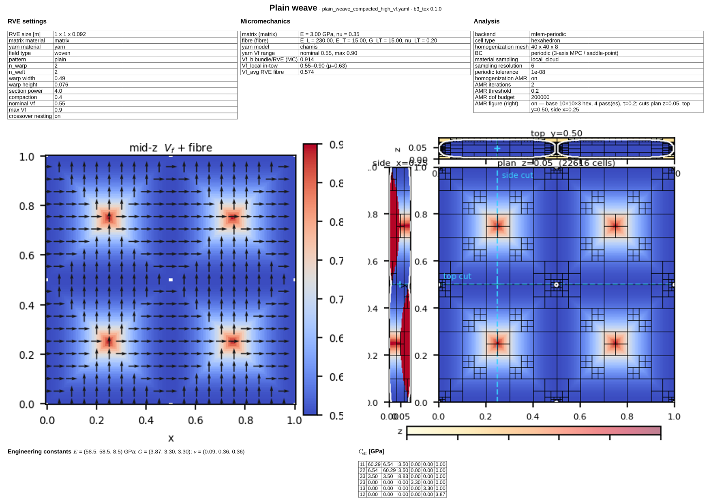
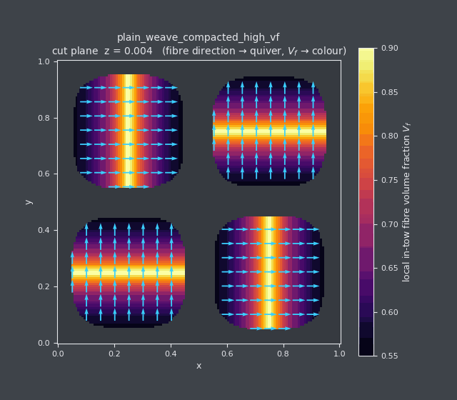
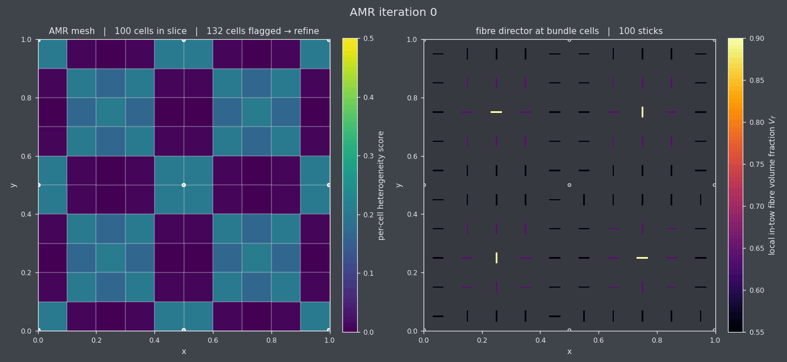

<a href="https://blade3.io"></a>

# b3_tex

Implicit modelling and homogenization of textile-composite RVEs on FEniCSx
**and** MFEM, with adaptive mesh refinement and a backend-agnostic
post-processing layer.

`b3_tex` represents the textile geometry **implicitly** — phase membership and
local fibre orientation are evaluated as a 3D field at any point — and uses a
structured FE mesh whose Gauss-point material lookup samples that field. No
yarn-surface meshing is needed, and the same field can drive an AMR marker
that refines around interfaces.

## Intent 
<!-- user written -> flesh out proper -->
Implicit modelling with AMR enables:
- Modelling robustness for high Vf textile structures with contact, meshing always feasible. 
- Convergence information included. 
- Fast to solve. 
- Extensible, yarn formulations not dependent on mesher. 


## Fabric architectures

A data-driven generator layer turns a fabric spec into implicit yarns (see
`examples/`). Pick one with `field.type`:

- **`woven`** — any 2D weave from a `pattern` block: `plain`, `twill(n_over,n_under,step)`,
  `satin(n,shift)`, `basket(n)`, or a custom `matrix`. Crimp, compaction and tow nesting
  come straight from the interlacing (`weave_twill_2x2`, `weave_satin_4h`, `weave_basket_2x2`).
- **`orthogonal`** / **`layer_to_layer`** — 3D woven: stacked warp/weft layers with a
  through-thickness or diagonal-interlock binder (`woven_3d_orthogonal`, `woven_layer_to_layer`).
- **`ncf`** — multi-axial non-crimp fabric: straight inlay plies at arbitrary angles +
  tricot/pillar stitch (`ncf_tricot_stitched`).
- **`braid`** — triaxial braid: axial + ±bias yarns (`triaxial_braid`).
- **`cylinder_yarn`** — single UD tow (cylinder); the simplest case (`examples/ud_tow.yaml`).
- **`multi_straight_yarn`** — hand-listed straight tows (manual control / validation).

The example set mirrors the [TexGenScripts](https://github.com/louisepb/TexGenScripts)
fabric library in SI metres. The legacy `plain_weave` / `parametric_plain_weave` /
`satin_weave` / `stitched_biaxial` types still work but are deprecated in favour of the
unified `woven` / `ncf` generators.

**Example material datasheet** (one-page PDF for the compacted high-Vf plain weave):

[](results/datasheet_plain_weave_compacted.pdf)

Regenerate: `b3-tex datasheet examples/plain_weave_compacted_high_vf.yaml -o results/datasheet_plain_weave_compacted.pdf` — see [docs/technical_datasheet.md](docs/technical_datasheet.md).

## What's in

- **Composable yarn geometry** (`b3_tex.geometry`): a yarn is a `Centerline`
  (sinusoidal / straight / **B-spline** / piecewise-linear) + a `CrossSection`
  (**super-ellipse / power-ellipse / lenticular**, with parameters that may
  **vary along the path**) wrapped in a `ParametricYarn` that does closest-point
  projection and reports a **local fibre volume fraction**.
- **Implicit phase fields**: cylinder / multi-straight-yarn / sinusoidal-yarn /
  plain-weave / **parametric (compacted) plain-weave** / **satin (5H/8H)** /
  stitched-biaxial NCF generators (`b3_tex.fields`). Vectorised
  `sample_arrays(pts) → (ids, rotations)` is the hot path; fields with variable
  sections also expose `sample_local_vf(pts)`.
- **Materials**: isotropic, transverse-isotropic, Chamis rule-of-mixtures, and
  **`micromechanical`** — a yarn whose stiffness is computed from its *local* Vf
  through a pluggable model (`b3_tex.materials`, `b3_tex.micromodels`).
- **Pluggable micromechanics** (`b3_tex.micromodels`): a `MicroModel` registry
  with `chamis` (baseline) and `mori_tanaka` built in, a `SurrogateModel`
  adapter for future neural-network models, and `synthetic_chamis_dataset` for
  generating training data. Compressed tows at crossovers come out stiffer
  because their local Vf is higher (fibre area is conserved).
- **Two FE backends**, each with KUBC and periodic BCs:
  - **DOLFINx + dolfinx_mpc** (fully supported). Tet and hex elements;
    cascading periodic-MPC pattern with non-overlapping per-axis slave masks
    and an interior translation pin.
  - **PyMFEM** (alternative). Tet and hex elements; periodic BCs implemented
    as MPC-style linear constraints on the augmented saddle-point system
    (because `mfem.Mesh.MakePeriodic` breaks under NCMesh refinement).
    Supports **hex AMR** via `NCMesh.GeneralRefinement`.
- **Adaptive refinement** (`b3_tex.amr`): per-cell heterogeneity marker
  (matrix-disagreement + within-yarn rotation spread) drives Plaza red-green
  refinement on tets (DOLFINx + MFEM) or NCMesh octree refinement on hexes
  (MFEM only). Sub-sampling defaults to a deterministic 10×10×10 tensor grid
  per cell so symmetric weaves refine 4-fold-symmetrically.
- **Backend-agnostic post-processing** (`b3_tex.postprocess`):
  - `compute_C_eff(session)` — strain-basis sweep used inside every
    backend's public `solve_periodic`.
  - `attach_homogenization_fields(session, grid)` — runs the strain basis
    *plus* 6 stress-controlled loadcases (uniaxial tension + pure shear) so
    Poisson contraction is allowed, attaches per-loadcase displacement /
    stress / strain VTK arrays, and emits two sanity reports:
    1. **Engineering-constant cross-check**: `1/S_eff[k,k]` vs
       `σ_target[k] / E_voigt[k]` from the FE response. Both extractions
       must agree to back-solve precision (~1e-8).
    2. **Material-sampling uniformity**: per-material Vf recovery from FE
       GPs vs random field sampling, per-yarn coverage CV (catches
       latent warp/weft asymmetries in the post-AMR mesh), and spatial
       GP-count distribution across coarse bins.
- **Validation**: rule-of-mixtures, Voigt/Reuss bounds, Mori-Tanaka
  closed-form. Periodic recovers homogeneous-matrix stiffness to machine
  precision, and `eigvalsh(C_kubc - C_periodic) ≥ 0` to ~5e-3 — both pinned
  by tests.

## Setup

DOLFINx is installed via conda-forge; PyMFEM via pip.

```sh
micromamba create -n b3-tex -c conda-forge \
    python=3.12 fenics-dolfinx dolfinx_mpc mpich numpy pyyaml pytest scipy
micromamba activate b3-tex
pip install treeparse pymfem            # PyMFEM downloads + builds in ~5 min
pip install -e .
```

`treeparse` is mandatory (CLI). `pymfem` is optional — only required if you
plan to use the `mfem-*` backends or the hex-AMR experiment.

## CLI

```
b3-tex validate  examples/plain_weave_high_vf.yaml
b3-tex reference examples/ud_tow.yaml
b3-tex solve     examples/ud_tow.yaml --out results
b3-tex solve     examples/ud_tow.yaml --backend mfem-periodic --cell-type hexahedron
b3-tex solve     examples/plain_weave_high_vf.yaml \
                 --backend mfem-periodic --cell-type hexahedron \
                 --amr-iterations 3 --amr-threshold 0.20
b3-tex datasheet examples/plain_weave_compacted_high_vf.yaml \
                 -o results/datasheet_plain_weave_compacted.pdf
```

Backend choices: `dolfinx-periodic` (default), `dolfinx-kubc`,
`mfem-periodic`, `mfem-kubc`. AMR is wired through the YAML
(`solver.amr.enabled`) or `--amr-iterations`. Hex AMR requires an `mfem-*`
backend (DOLFINx 0.10's `refine_plaza` is tet-only).

`solve` writes `C_eff.npz` and prints the 6×6 effective stiffness.

## Picking a backend

**Recommended default: `mfem-periodic`** (especially when you want hex elements or AMR).

| | MFEM-periodic (recommended) | DOLFINx-periodic |
|---|---|---|
| Status | **preferred for efficiency & hex AMR** | fully supported (great for tets) |
| Tet AMR | yes (Plaza red-green) | yes (Plaza red-green) |
| Hex AMR | **yes** (NCMesh octree) | **no** (refine_plaza is tet-only in 0.10) |
| Periodic BC mechanism | augmented saddle-point with explicit C^T | `dolfinx_mpc` cascading slave masks |
| Speed | LU factorisation reused across loadcases | usually faster (compiled kernels) on tets |
| Cross-validation | `tests/test_mfem.py::test_*_agree_on_ud_tow` |  |

Both produce the same C_eff to <2 % relative Frobenius on the same UD-tow
mesh; both give the same engineering constants to back-solve precision when
driven through `b3_tex.postprocess`.

## MFEM backend specifics

- **Why MPC instead of `mfem.Mesh.MakePeriodic`**: under NCMesh hex
  refinement, mesh-level periodicity breaks (mid-edge vertices land at the
  geometric midpoint of edges whose endpoints are periodic identifications,
  producing elongated cells with extent ~0.7 across a unit box). The MPC
  path keeps the mesh non-periodic and enforces u[slave] = u[master] as
  linear constraints on T-DOFs. Hanging vertices are skipped (their
  periodicity is induced through their NC parents). Vertex 0's three
  components are pinned to remove rigid-body translation.
- **Custom integrator**: `_AnisotropicElasticityIntegrator` (a
  `PyBilinearFormIntegrator` subclass) reads pre-computed per-GP rotated
  stiffness via `T.ElementNo`. Per-GP material lookup happens once during
  setup (one batched call to `b3_tex.quadrature.global_stiffness_at_points`)
  rather than per integrator call — yields a ~12× speedup over the naive
  per-GP Python lookup.
- **Session pattern**: `MfemPeriodicSession(problem)` does the heavy
  lifting once (mesh + assemble + factor LU) and exposes
  `solve_macro_strain(E_voigt) → LoadcaseSolveResult` for each subsequent
  back-solve. The public `solve_periodic` is now a 25-line wrapper around
  this session driven through `b3_tex.postprocess.compute_C_eff`.
- **Cell-type override**: `solver.cell_type: hexahedron` (default
  tetrahedron) builds the base mesh with hex elements; FE quadrature is
  `q=2`, i.e. 8 GPs/cell tensor 2×2×2 GL for hex, 4-pt Hammer for tet.

## Examples

| script | what it does |
|---|---|
| `examples/ud_tow.yaml` | 1×1×1 cube with a single UD cylinder; canonical validation case. |
| `examples/plain_weave_2x2.yaml`, `..._dense.yaml`, `..._high_vf.yaml` | Plain-weave RVEs at increasing fibre-volume fraction. |
| `examples/plain_weave_compacted_high_vf.yaml` | Plain weave with a tow cross-section that is **compressed at crossovers**; a `micromechanical` yarn so the local Vf (and stiffness) rises there. |
| `examples/satin_5h.yaml`, `examples/satin_8h.yaml` | 5- and 8-harness satin weaves (long, low-crimp floats) via the `satin_weave` field. |
| `examples/ncf_biaxial_high_vf.yaml` | High-Vf stitched biaxial NCF (straight carbon plies + z-stitches). |
| `examples/high_vf_architectures.py` | Builds plain / satin-5H / satin-8H / NCF, reports yarn Vf and in-tow local-Vf range, solves each, and plots the engineering constants. |
| `examples/material_datasheet.py` | One-page **technical material datasheet** (Typst PDF): RVE + micromechanics + fibre quiver + AMR mesh + $C_\mathrm{eff}$. → [results/datasheet_plain_weave_compacted.pdf](results/datasheet_plain_weave_compacted.pdf) |
| `examples/section_sweep_gif.py` | Animated cut-plane sweep through an RVE: quiver of the local **fibre direction** over a colour map of the local **in-tow Vf**. Pure field visualisation (no FE solve). `--axis {x,y,z}`. → [results/section_sweep.gif](results/section_sweep.gif) |
| `examples/amr_development_gif.py` | Animated **AMR refinement development** (two panels per frame): left = hex footprints at a mid-slice coloured by heterogeneity score (mesh concentrating on the tow/matrix interface); right = a **line-quiver of the fibre director at the cells that land in bundle material**, coloured by local Vf, densifying as the mesh refines. Needs the MFEM backend. → [results/amr_development.gif](results/amr_development.gif) |
| `examples/mesomech_2yarns.yaml` | Two non-parallel straight yarns; multi-material Chamis. |
| `examples/convergence_study_weave.py` | Mesh sweep × quadrature degree × (tet vs hex) × (centroid vs GP-lookup) — produces 7 panels. |
| `examples/mfem_weave_amr.py` | Headline AMR demo: hex (NCMesh) and tet (Plaza) on the same plain-weave problem. Convergence panel with E_x, E_z vs total Gauss points. |
| `examples/_export_amr_mesh_for_paraview.py` | One-shot diagnostic: AMR mesh + 6 stress-controlled loadcases worth of u/σ/ε arrays exported to VTK. Runs the cross-check + sampling-uniformity reports. |

### Output (GIFs)

**Section sweep** — local fibre direction and in-tow Vf on a moving cut plane
([`section_sweep_gif.py`](examples/section_sweep_gif.py)):



**AMR development** — mesh heterogeneity map and bundle fibre directors as
refinement progresses ([`amr_development_gif.py`](examples/amr_development_gif.py)):



## Repo conventions 

- `src/b3_tex/backends/` is the **only** place that imports `dolfinx`,
  `dolfinx_mpc`, `ufl`, `mpi4py`, `petsc4py`, or `mfem`. Everything else
  stays pure NumPy + PyYAML so it runs in any environment.
- Voigt order is `(11, 22, 33, 23, 13, 12)`. Voigt strain uses
  **engineering shear**: `[ε11, ε22, ε33, 2ε23, 2ε13, 2ε12]`. Stiffness `C`
  is the matrix such that `σ_voigt = C @ ε_voigt` with no factors of 2.
- Yarn local axis is the **first** column of the rotation matrix returned
  by `PhaseField.sample`, i.e. `R[:, 0]` is the local 1-direction.
  Transverse-isotropic stiffness has its symmetry axis along local 1.
- Tests marked `@pytest.mark.fenicsx` and `@pytest.mark.mfem` are
  auto-skipped if their respective library is unimportable.

## Tests

```sh
micromamba run -n b3-tex pytest                # all tests (151 currently)
micromamba run -n b3-tex pytest -m fenicsx     # DOLFINx-only
micromamba run -n b3-tex pytest -m mfem        # MFEM-only
micromamba run -n b3-tex pytest tests/test_amr.py tests/test_mfem.py -v
```
