<a href="https://blade3.io"></a>

# b3_tex

[](https://github.com/wr1/b3_tex/actions/workflows/ci.yml)
[](https://github.com/wr1/b3_tex/actions/workflows/ci.yml)
[](https://www.python.org/downloads/)
[](LICENSE)
[](https://github.com/astral-sh/ruff)
[](https://github.com/pre-commit/pre-commit)

**Robust, automated** textile RVE homogenization — implicit geometry, adaptive
meshing, and a one-command path from fabric to **C_eff** / datasheet.

**Author fabrics in Python** ([textile-as-code](docs/reference/textile-as-code.mdx));
YAML remains an optional CLI card format. Built for cases where body-fitted yarn
meshing fails: high fibre packing, tow contact / interpenetration, and
architecture sweeps that must re-mesh reliably without hand-edited CAD.

## Intent

| Goal | How |
|------|-----|
| **Robustness** | Geometry is an *implicit field* (phase + fibre direction at any point). No yarn-surface mesh. High-Vf contact stays discretizable. AMR refines interfaces; interiors stay coarse. |
| **Realistic Vf** | Run at production packing fractions without body-fitted meshing failures. Compaction / nesting raise *in-tow* Vf at crossovers; the FE mesh still resolves the field. |
| **Automation** | Textile-as-code (`.py` card or `b3_tex.textile` builders) → validate → solve (periodic, 6 loadcases) → `C_eff.npz` + optional datasheet. YAML cards still load via the same pipeline. |
| **Built-in convergence info** | Results include mesh, backend, AMR settings, yarn Vf, and wall time (`C_eff.meta.json`), plus optional AMR history and sampling-uniformity checks. |
| **Consistency** | Yarn cards from `b3_micromech` (or Chamis) plug in as `micromodel`; local Vf at crossovers is automatic. Same Voigt / fibre-axis conventions end-to-end. |
| **Speed where it matters** | Background hex mesh + MFEM NCMesh AMR (or DOLFINx tets); material sampling and solvers are scriptable for sweeps and agent runs. |

```text
textile-as-code (.py) or YAML card
        →  RVEProblem  →  implicit field  →  AMR mesh
        →  6 unit strains  →  C_eff + meta + datasheet
                      ↑
              yarn micromodel (chamis | fea_hex | …)
```

## Quick start (textile-as-code)

Prefer typed builders for new work, sweeps, and agent paths. YAML is optional
serialisation for frozen CLI cards — not the fabric model.

```python
from b3_tex import Material, WeaveGeometry, WeavePattern, textile

matrix = Material.isotropic("matrix", youngs_modulus=3.5e9, poisson_ratio=0.35)
fibre = Material.transverse_isotropic(
    "fibre", e_l=230e9, e_t=15e9, g_lt=15e9, nu_lt=0.20, nu_tt=0.30
)
yarn = textile.micromechanical(
    "yarn", matrix=matrix, fibre=fibre, micromodel="chamis",
    nominal_vf=0.55, max_vf=0.90,
)
domain = (0.02, 0.02, 0.0024)
field = textile.woven(
    WeavePattern.twill(2, 2, n_warp=4, n_weft=4),
    WeaveGeometry(
        domain_size=domain, warp_width=0.004, warp_height=0.0008,
        power=4.0, compaction=0.3, nest=True,
    ),
    matrix=matrix, yarn=yarn,
)
problem = textile.rve(
    field, [matrix, fibre, yarn],
    size=domain, mesh_resolution=(24, 24, 6),
    solver=textile.solver_config(amr=True),
)
# result = textile.solve(problem)   # needs MFEM/DOLFINx env
```

Runnable card with the same geometry: [`examples/weave_twill_2x2.py`](examples/weave_twill_2x2.py)
(`build() -> RVEProblem`). CLI accepts `.py` or `.yaml`:

```bash
b3-tex validate examples/weave_twill_2x2.py
b3-tex solve    examples/weave_twill_2x2.py -o results/weave_twill_2x2
# datasheet still takes a YAML path for labels; reuse C_eff from the .py solve
b3-tex datasheet examples/weave_twill_2x2.yaml \
  -o results/datasheet_weave_twill_2x2.pdf \
  --c-eff results/weave_twill_2x2/C_eff.npz
```

API: `textile.micromechanical`, `woven` / `ncf` / `braid`, `rve`, `solver_config`,
`solve`, `load_problem` — see [docs/reference/textile-as-code.mdx](docs/reference/textile-as-code.mdx)
and repo-root [`SKILL.md`](SKILL.md).

## Fabric architectures

Generators turn a fabric spec into implicit yarns (`b3_tex.generators` +
`b3_tex.textile`). In code use `WeavePattern` + `WeaveGeometry` (or the NCF/braid
helpers); in YAML set `field.type`:

| Family | Code / YAML | Examples |
|--------|-------------|----------|
| 2D weave | `textile.woven` / `woven` | plain, twill, satin, basket, custom matrix — `weave_twill_2x2.py`, `weave_satin_4h`, `weave_basket_2x2` |
| 3D woven | YAML `orthogonal` / `layer_to_layer` | `woven_3d_orthogonal`, `woven_layer_to_layer` |
| NCF | `textile.ncf` / `ncf` | multi-axial inlays + tricot/pillar — `ncf_tricot_stitched` |
| Braid | `textile.braid` / `braid` | triaxial axial + ±bias — `triaxial_braid` |
| UD / manual | YAML `cylinder_yarn` / `multi_straight_yarn` | `ud_tow.yaml` |

Crimp, compaction, and nesting for 2D weaves come from the interlacing pattern.
The example set mirrors [TexGenScripts](https://github.com/louisepb/TexGenScripts)
in SI metres. Legacy `plain_weave` / `parametric_plain_weave` / `satin_weave` /
`stitched_biaxial` still load but are deprecated in favour of `woven` / `ncf`.

**Example material datasheet** (one-page PDF for the compacted high-Vf plain weave):

[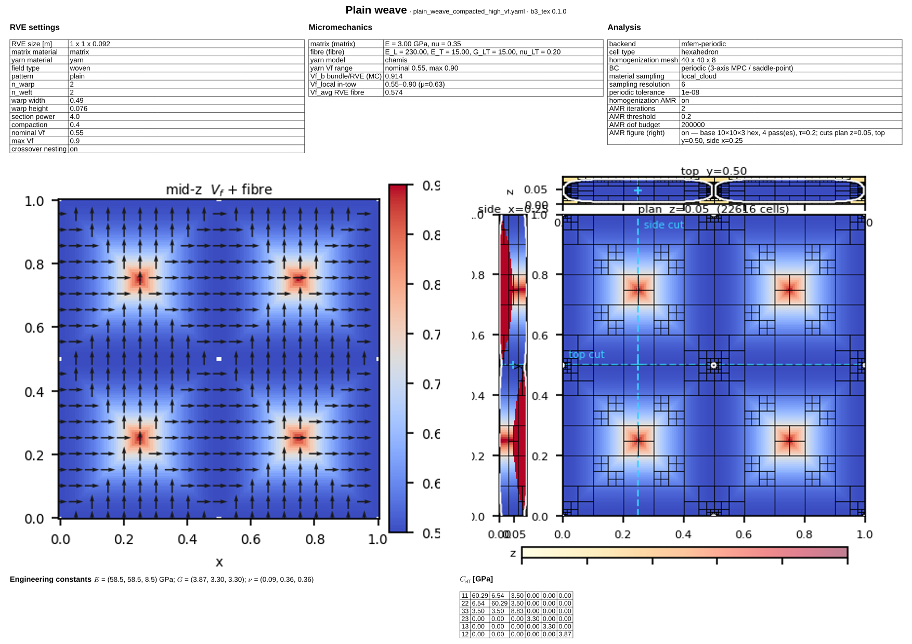](results/datasheet_plain_weave_compacted.pdf)

Regenerate: `b3-tex datasheet examples/plain_weave_compacted_high_vf.yaml -o results/datasheet_plain_weave_compacted.pdf` — see [docs/guides/datasheet.mdx](docs/guides/datasheet.mdx).

## Documentation site (DocKB)

Public docs are Fumadocs MDX under `docs/`. Serve with the shared DocKB runtime:

```bash
make docs              # dockb on PORT=3000 (auto-skips busy ports)
make docs PORT=3011
make help              # self-documenting targets
# equivalent: dockb   (needs ~/apps/dockb-runtime + dockb on PATH)
```

- Guides: [getting started](docs/guides/getting-started.mdx),
  [twill 2×2 agent path](docs/guides/agent-twill-stiffness.mdx),
  [CLT crossply vs weave FE](docs/guides/compare-simple-crossply.mdx),
  [datasheet](docs/guides/datasheet.mdx), [convergence](docs/guides/convergence.mdx)
- Reference: [architecture](docs/reference/architecture.mdx),
  **[textile-as-code](docs/reference/textile-as-code.mdx)** (preferred API),
  [CLI](docs/reference/cli.mdx), [micromechanics](docs/reference/micromechanics.mdx),
  [YAML schema](docs/reference/yaml-schema.mdx) (optional card format)
- Agent playbook: [`SKILL.md`](SKILL.md)

## What's in

- **Textile-as-code** (`b3_tex.textile`): typed fabric builders and `RVEProblem`
  assembly without YAML dicts; CLI loads `.py` cards via `build()` / `problem`.
- **Composable yarn geometry** (`b3_tex.geometry`): a yarn is a `Centerline`
  (sinusoidal / straight / **B-spline** / piecewise-linear) + a `CrossSection`
  (**super-ellipse / power-ellipse / lenticular**, with parameters that may
  **vary along the path**) wrapped in a `ParametricYarn` that does closest-point
  projection and reports a **local fibre volume fraction**. `WeavePattern`
  drives 2D interlacing (plain / twill / satin / basket / matrix).
- **Implicit phase fields** (`b3_tex.fields` + generators): parametric weaves,
  NCF, braid, 3D woven, cylinder / multi-straight yarns. Vectorised
  `sample_arrays(pts) → (ids, rotations)` is the hot path; variable sections
  also expose `sample_local_vf(pts)`.
- **Materials**: isotropic, transverse-isotropic, Chamis rule-of-mixtures, and
  **`micromechanical`** — a yarn whose stiffness is computed from its *local* Vf
  through a pluggable model (`b3_tex.materials`, `b3_tex.micromodels`).
- **Pluggable micromechanics** (`b3_tex.micromodels`): a `MicroModel` registry
  with `chamis` (baseline) and `mori_tanaka` built in, a `SurrogateModel`
  adapter for future neural-network models, and `synthetic_chamis_dataset` for
  generating training data. Compressed tows at crossovers come out stiffer
  because their local Vf is higher (fibre area is conserved).
- **Two FE backends**, each with KUBC and periodic BCs:
  - **PyMFEM** (CLI default `mfem-periodic`). Tet and hex; periodic BCs as
    MPC-style constraints on an augmented saddle-point system. **Hex AMR** via
    `NCMesh.GeneralRefinement`.
  - **DOLFINx + dolfinx_mpc** (fully supported). Tet and hex; cascading
    periodic-MPC with non-overlapping per-axis slave masks and an interior
    translation pin. Prefer for pure tet meshes without hex AMR.
- **Adaptive refinement** (`b3_tex.amr`): per-cell heterogeneity marker
  (matrix-disagreement + within-yarn rotation spread) drives Plaza red-green
  refinement on tets (DOLFINx + MFEM) or NCMesh octree refinement on hexes
  (MFEM only).
- **Backend-agnostic post-processing** (`b3_tex.postprocess`):
  - `compute_C_eff_with_columns(session)` — the single strain-basis sweep.
    Every backend's `solve_elastic` calls it through
    `backends._driver.solve_with_session`. `compute_C_eff(session)` is the
    stiffness-only wrapper (used by `attach_homogenization_fields`).
  - `attach_homogenization_fields(session, grid)` — strain basis *plus* 6
    stress-controlled loadcases, VTK arrays, engineering-constant cross-check,
    and material-sampling uniformity reports.
- **Validation**: rule-of-mixtures, Voigt/Reuss bounds, Mori-Tanaka
  closed-form. Periodic recovers homogeneous-matrix stiffness to machine
  precision, and `eigvalsh(C_kubc - C_periodic) ≥ 0` to ~5e-3 — both pinned
  by tests.

## Setup

Core dependencies are NumPy, SciPy, PyYAML, treeparse, and matplotlib.
`mfem` and `numba` are the `[mfem]` extra (PyPI package `mfem`, not `pymfem`).
DOLFINx, `dolfinx_mpc`, `ufl`, `basix`, `mpi4py`, and `petsc4py` are
conda-forge only — do not pip-install them.

```sh
pip install 'b3-tex[mfem]'          # recommended solver (hex AMR)
pip install 'b3-tex[viz]'           # pyvista / gif helpers
pip install 'b3-tex[test]'          # pytest
pip install 'b3-tex[all]'           # mfem + viz + test

# Optional DOLFINx backends (conda-forge, not a pip extra):
micromamba create -n b3-tex -c conda-forge \
    python=3.12 fenics-dolfinx dolfinx_mpc mpich
micromamba activate b3-tex
pip install 'b3-tex[mfem]'
```

`treeparse` is mandatory (CLI). The `[mfem]` extra is required for the
recommended `mfem-*` backends and hex AMR; DOLFINx is optional if you only use MFEM.

## CLI

```bash
# Smoke / UD validation (YAML card)
b3-tex validate  examples/ud_tow.yaml
b3-tex reference examples/ud_tow.yaml
b3-tex solve     examples/ud_tow.yaml -o results/ud_tow

# Production weave path — textile-as-code preferred
b3-tex validate examples/weave_twill_2x2.py
b3-tex solve    examples/weave_twill_2x2.py -o results/weave_twill_2x2 \
                --backend mfem-periodic --cell-type hexahedron

# Optional: denser AMR, YAML card still works
b3-tex solve examples/plain_weave_high_vf.yaml -o results/plain_high_vf \
             --amr-iterations 3 --amr-threshold 0.20

# Datasheet (YAML path; reuse C_eff from a prior solve)
b3-tex datasheet examples/plain_weave_compacted_high_vf.yaml \
  -o results/datasheet_plain_weave_compacted.pdf
b3-tex datasheet examples/weave_twill_2x2.yaml \
  -o results/datasheet_weave_twill_2x2.pdf \
  --c-eff results/weave_twill_2x2/C_eff.npz
```

| Command | Card types |
|---------|------------|
| `validate` / `reference` / `solve` | `.yaml` / `.yml` or `.py` (`build()` or `problem`) |
| `datasheet` | YAML today (use `--c-eff` after a `.py` solve) |

Backend choices: `mfem-periodic` (CLI default, recommended for hex AMR),
`mfem-kubc`, `dolfinx-periodic`, `dolfinx-kubc`. AMR is wired through the card
(`solver.amr` / `solver_config(amr=…)`) or `--amr-iterations`. Hex AMR needs
an `mfem-*` backend (DOLFINx 0.10 `refine_plaza` is tet-only).

`solve` writes `C_eff.npz` (array key `effective_stiffness`, Pa) plus
`C_eff.meta.json` (mesh, backend, AMR, yarn Vf, wall time), and prints the
6×6 matrix and engineering constants.

## Picking a backend

**Recommended default: `mfem-periodic`** (especially when you want hex elements or AMR).

| | MFEM-periodic (recommended) | DOLFINx-periodic |
|---|---|---|
| Status | **preferred for efficiency & hex AMR** | fully supported (great for tets) |
| Tet AMR | yes (Plaza red-green) | yes (Plaza red-green) |
| Hex AMR | **yes** (NCMesh octree) | **no** (refine_plaza is tet-only in 0.10) |
| Periodic BC mechanism | augmented saddle-point with explicit C^T | `dolfinx_mpc` cascading slave masks |
| Speed | LU factorisation reused across loadcases | usually faster (compiled kernels) on tets |
| Cross-validation | `tests/test_mfem.py::test_*_agree_on_ud_tow` |  |

Both produce the same C_eff to <2 % relative Frobenius on the same UD-tow
mesh; both give the same engineering constants to back-solve precision when
driven through `b3_tex.postprocess`.

## MFEM backend specifics

- **Why MPC instead of `mfem.Mesh.MakePeriodic`**: under NCMesh hex
  refinement, mesh-level periodicity breaks (mid-edge vertices land at the
  geometric midpoint of edges whose endpoints are periodic identifications,
  producing elongated cells with extent ~0.7 across a unit box). The MPC
  path keeps the mesh non-periodic and enforces u[slave] = u[master] as
  linear constraints on T-DOFs. Hanging vertices are skipped (their
  periodicity is induced through their NC parents). Vertex 0's three
  components are pinned to remove rigid-body translation.
- **Custom integrator**: `_AnisotropicElasticityIntegrator` (a
  `PyBilinearFormIntegrator` subclass) reads pre-computed per-GP rotated
  stiffness via `T.ElementNo`. Per-GP material lookup happens once during
  setup (one batched call to `b3_tex.quadrature.global_stiffness_at_points`)
  rather than per integrator call — yields a ~12× speedup over the naive
  per-GP Python lookup.
- **Session pattern**: `MfemPeriodicSession(problem)` does the heavy
  lifting once (mesh + assemble + factor LU) and exposes
  `solve_macro_strain(E_voigt) → LoadcaseSolveResult` for each subsequent
  back-solve. `solve_elastic` (and the deprecated `solve_periodic` alias)
  is `solve_with_session` around that session, which calls
  `postprocess.compute_C_eff_with_columns` — not a private strain loop.
- **Cell type**: omitting `solver.cell_type` uses the MFEM default
  `hexahedron`. Set `tetrahedron` for tets. FE quadrature is
  `q=2`, i.e. 8 GPs/cell tensor 2×2×2 GL for hex, 4-pt Hammer for tet.

## Examples

| path | what it does |
|---|---|
| **`examples/weave_twill_2x2.py`** | **Textile-as-code** twill 2×2 card (`build()` / `build(smoke=True)`); YAML twin for datasheet. |
| `examples/compare_simple_crossply.py` | CLT [0/90] at Vf_total=yarn_vf×Vf_tow vs high-packing weave FE. |
| `examples/weave_twill_2x2.yaml` | Same geometry as data card (optional). |
| `examples/ud_tow.yaml` | 1×1×1 cube with a single UD cylinder; canonical validation case. |
| `examples/plain_weave_2x2.yaml`, `..._dense.yaml`, `..._high_vf.yaml` | Plain-weave RVEs at increasing fibre-volume fraction. |
| `examples/plain_weave_compacted_high_vf.yaml` | Plain weave with **compaction** at crossovers + `micromechanical` yarn (local Vf). |
| `examples/satin_5h.yaml`, `examples/satin_8h.yaml`, `weave_satin_4h.yaml` | Satin weaves (long floats) via `woven` + satin pattern. |
| `examples/weave_basket_2x2.yaml` | Basket 2×2. |
| `examples/ncf_tricot_stitched.yaml`, `ncf_biaxial_high_vf.yaml` | Multi-axial NCF + stitch. |
| `examples/triaxial_braid.yaml` | Triaxial braid. |
| `examples/woven_3d_orthogonal.yaml`, `woven_layer_to_layer.yaml` | 3D woven families. |
| `examples/high_vf_architectures.py` | Builds plain / satin / NCF, reports yarn Vf and local-Vf range, solves, plots constants. |
| `examples/material_datasheet.py` | One-page **technical material datasheet** (Typst PDF). → [results/datasheet_plain_weave_compacted.pdf](results/datasheet_plain_weave_compacted.pdf) |
| `examples/section_sweep_gif.py` | Cut-plane sweep: fibre quiver + local in-tow Vf (no FE). → [docs/images/section_sweep.gif](docs/images/section_sweep.gif) |
| `examples/amr_development_gif.py` | AMR refinement animation (heterogeneity + fibre directors). Needs MFEM. → [docs/images/amr_development.gif](docs/images/amr_development.gif) |
| `examples/make_fabric_gifs.py` | Gallery driver: section-sweep + AMR gifs for the architecture library. |
| `examples/mesomech_2yarns.yaml` | Two non-parallel straight yarns; multi-material Chamis. |
| `examples/convergence_study_weave.py` | Mesh × degree × (tet vs hex) × sampling — multi-panel study. |
| `examples/mfem_weave_amr.py` | Hex NCMesh vs tet Plaza AMR on the same weave; convergence panel. |
| `examples/_export_amr_mesh_for_paraview.py` | AMR mesh + stress-controlled loadcases to VTK; sampling reports. |

### Showcase (theme: cividis Vf · coolwarm/RdBu OOP · YlOrRd AMR · OrRd |von Mises|)

Shared palette in [`src/b3_tex/viz/theme.py`](src/b3_tex/viz/theme.py)
(`DEFAULT_THEME` / `STUDIO_THEME` / `DATASHEET_THEME`). Stills under
[`docs/images/`](docs/images/).

**Fibre orientation — up / down crimp** — not just the in-plane director:
centerline elevation (literal undulation), mid-plane path height
(over = red / under = blue) with climbing △ / descending ▽ markers, and a
side cut of the yarn path
([`render_midplane_orientation`](src/b3_tex/viz/slices.py)):

<p align="center">
  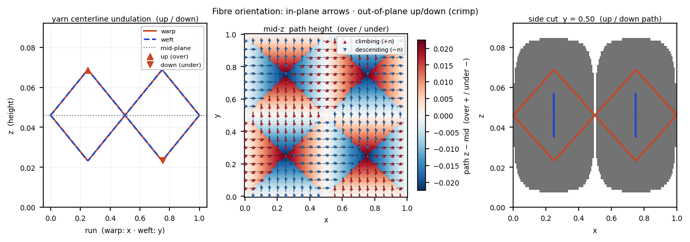
</p>

**Section sweep** — local fibre direction and in-tow Vf on a cut plane
([`section_sweep_gif.py`](examples/section_sweep_gif.py)):

<p align="center">
  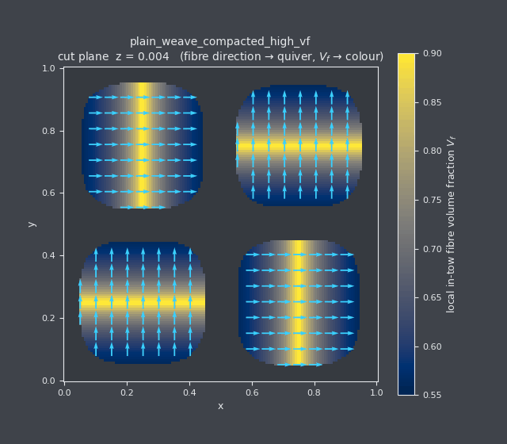
  &nbsp;
  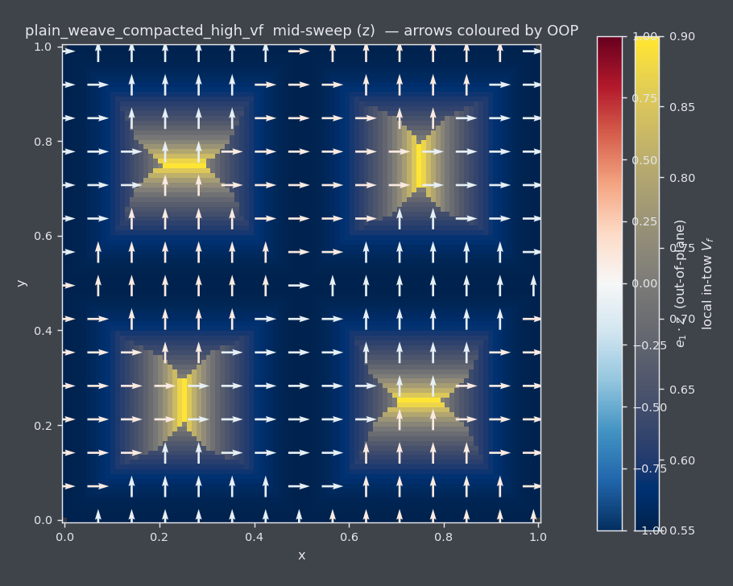
</p>

**AMR development** — heterogeneity map and bundle fibre directors as
refinement progresses ([`amr_development_gif.py`](examples/amr_development_gif.py)):

<p align="center">
  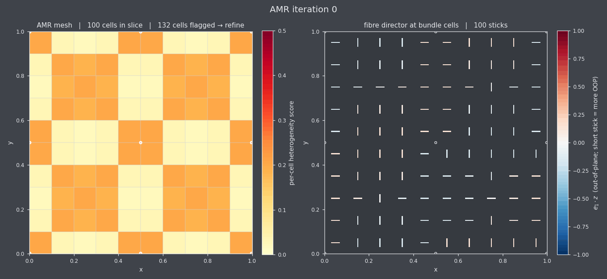
  &nbsp;
  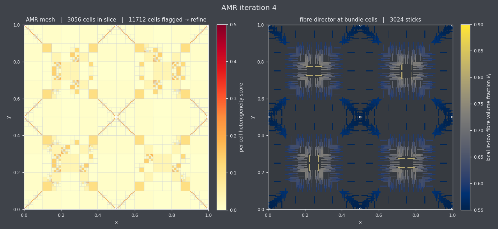
</p>

**Weave overview · mesh evolution · uniaxial response**

<p align="center">
  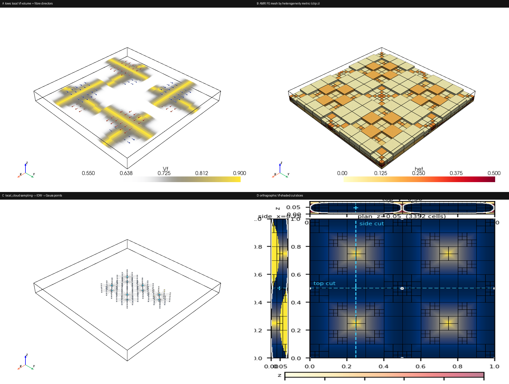
  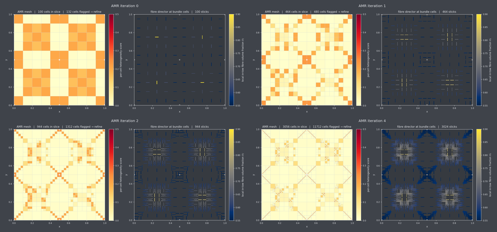
  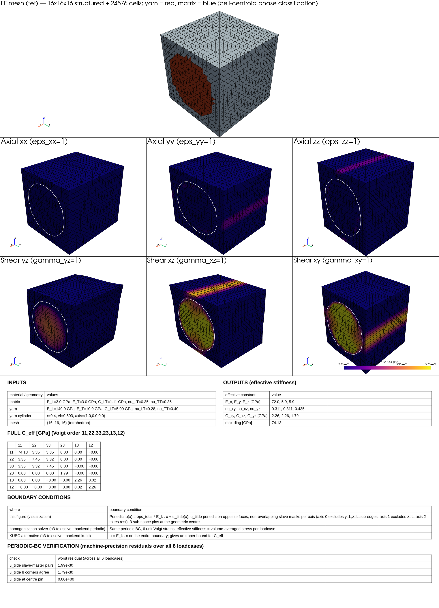
</p>

**Architecture library** (mid cut-plane Vf + fibre quiver; same colour scale)

| Twill 2×2 | Basket 2×2 | Satin 4H | Satin 5H |
|:---:|:---:|:---:|:---:|
| 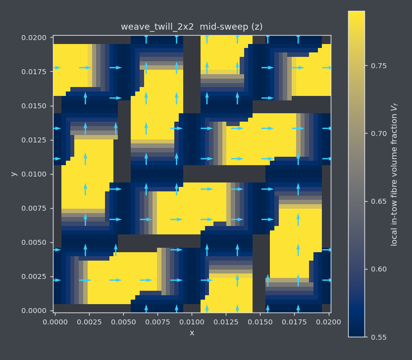 | 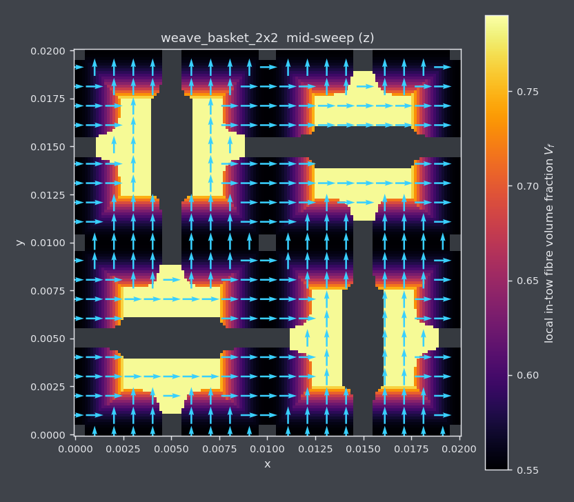 | 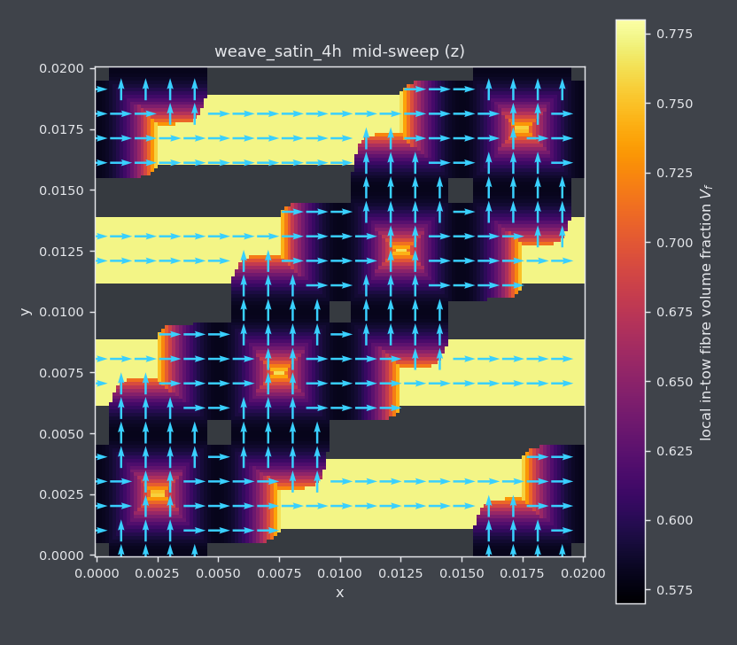 | 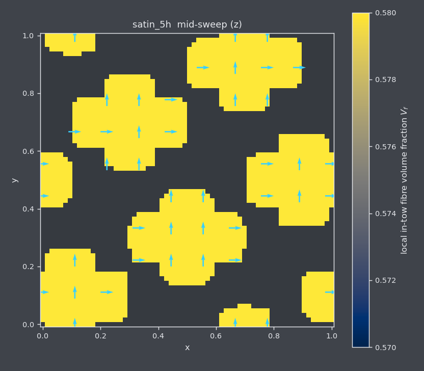 |

| NCF tricot | Triaxial braid | 3D orthogonal | Twill 3D section |
|:---:|:---:|:---:|:---:|
| 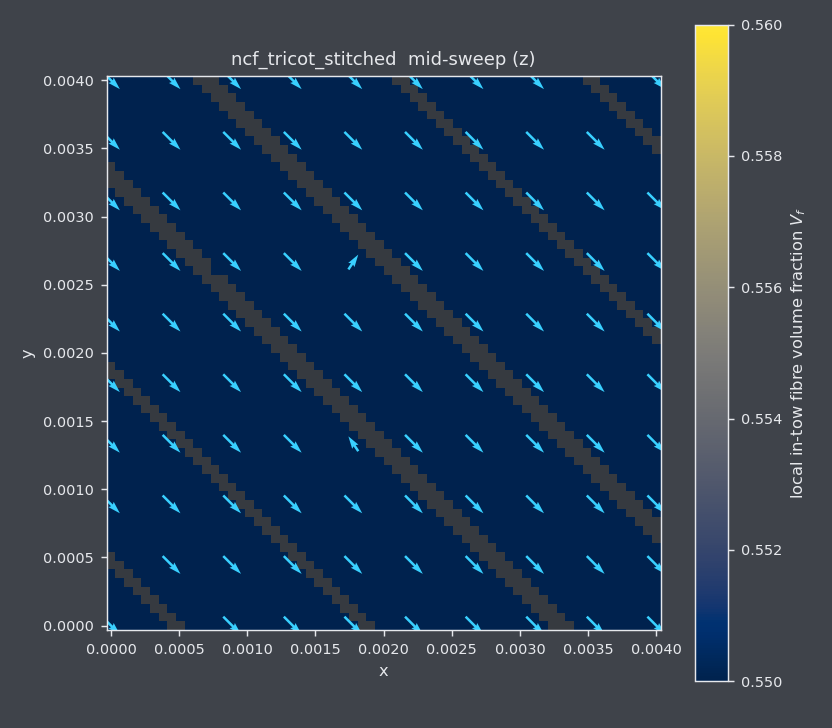 | 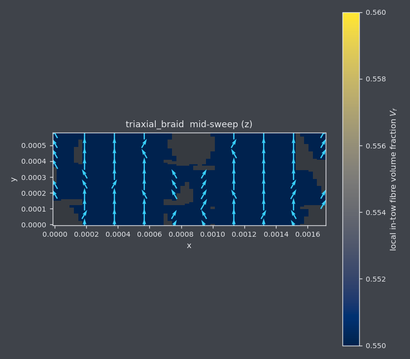 | 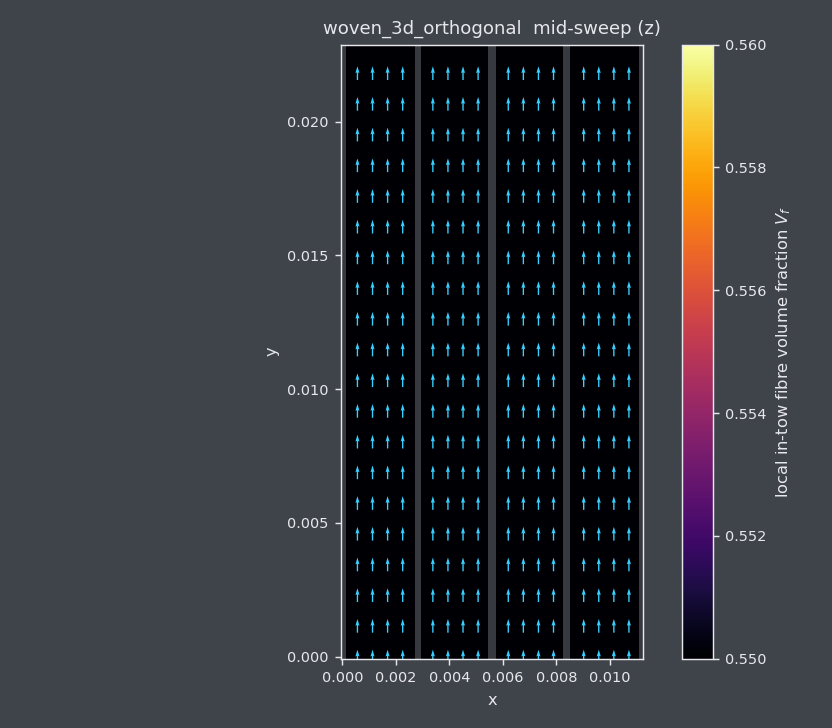 | 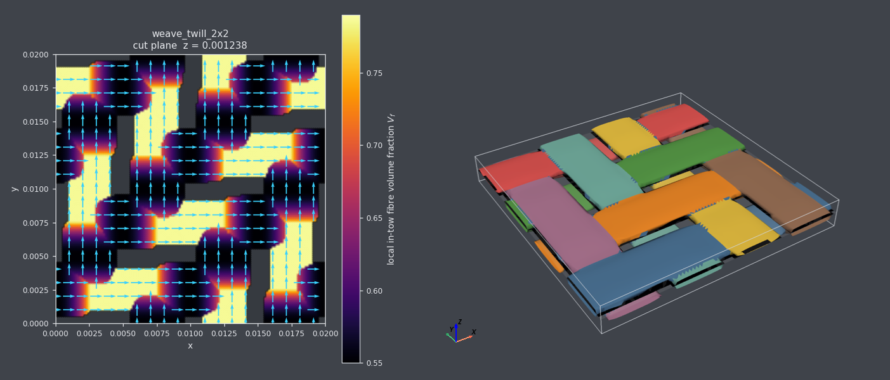 |

## Repo conventions

- **Authoring:** textile-as-code first (`b3_tex.textile`, example `.py` cards).
  YAML is optional serialisation for CLI cards / datasheet labels — do not grow
  a richer YAML DSL for callables or sweeps.
- `src/b3_tex/backends/` is the **only** place that imports `dolfinx`,
  `dolfinx_mpc`, `ufl`, `mpi4py`, `petsc4py`, or `mfem`. Everything else
  stays pure NumPy (+ PyYAML for card load) so it runs in any environment.
- Voigt order is `(11, 22, 33, 23, 13, 12)`. Voigt strain uses
  **engineering shear**: `[ε11, ε22, ε33, 2ε23, 2ε13, 2ε12]`. Stiffness `C`
  is the matrix such that `σ_voigt = C @ ε_voigt` with no factors of 2.
- Yarn local axis is the **first** column of the rotation matrix returned
  by `PhaseField.sample`, i.e. `R[:, 0]` is the local 1-direction.
  Transverse-isotropic stiffness has its symmetry axis along local 1.
- Tests marked `@pytest.mark.fenicsx` and `@pytest.mark.mfem` are
  auto-skipped if their respective library is unimportable.
- Full conventions: [`CLAUDE.md`](CLAUDE.md) and [`SKILL.md`](SKILL.md).

## Tests

The non-DOLFINx suite is the PR gate (`test` on Python 3.11–3.12 without MFEM,
and `test-mfem` on 3.12). DOLFINx (`-m fenicsx`) runs weekly, on
`workflow_dispatch`, and when DOLFINx backend files change — not on every push.
The coverage badge is pure-Python plus the MFEM job; DOLFINx runs weekly and
is excluded from the badge.

```sh
pip install -e ".[test]"
pytest -q -m "not fenicsx"          # PR gate without MFEM (those tests skip)

pip install -e ".[test,mfem]"
pytest -q -m "not fenicsx"          # same suite with MFEM

# DOLFINx (conda env; weekly CI, not the PR gate)
pytest -q -m fenicsx
```
