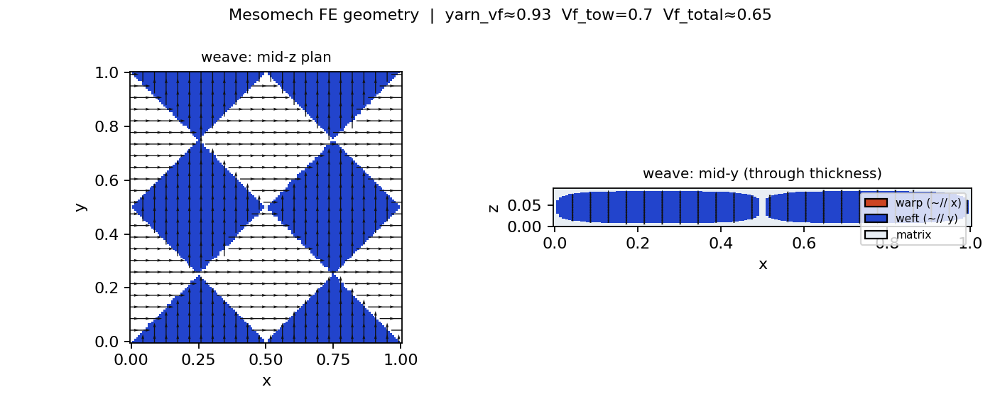
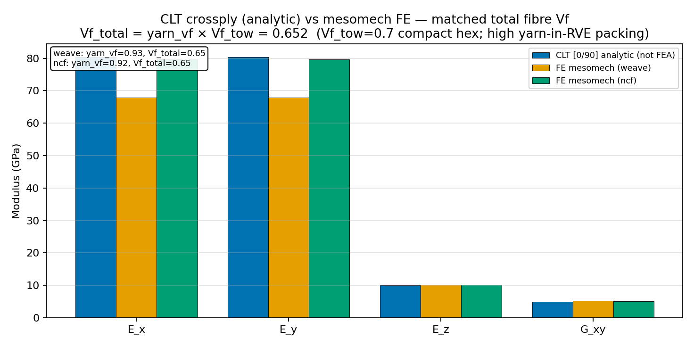
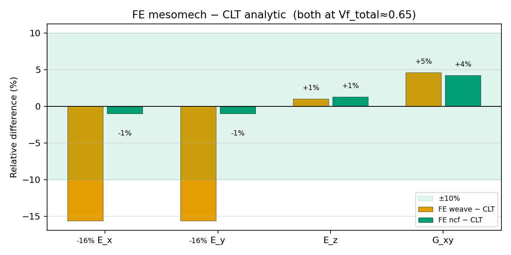

## Intent

Weaves are often modelled as a **flat [0/90] CLT laminate**. That CLT step is
**analytic** (closed-form stack algebra — **not FEA**).

Compare that shortcut to **proper mesomech FE** on a high-packing weave, with
**matched total fibre content**.

## Matching protocol (total Vf)

```text
1. Weave FE: high Vf_tow (compact hex packing in the yarn, e.g. 0.70)
             + high yarn-in-RVE packing (nested / super-ellipse)

2. Measure yarn_vf = (yarn bundle volume) / (RVE volume)

3. Vf_total = yarn_vf × Vf_tow     ← overall fibre fraction in the RVE

4. CLT [0/90] analytic:
     continuum UD ply = Chamis(matrix, fibre, Vf_total)
     then equal [0/90] CLT (A-matrix)   — optional b3_mat / lamprop-style check
```

So CLT and FE both represent the **same overall fibre Vf**. Remaining differences
are mainly **crimp / architecture**, not “CLT used more fibre”.

```text
                    ┌─ FE weave: yarns at Vf_tow, packing yarn_vf
fibre, matrix ──────┤
                    └─ CLT: continuum plies at Vf_total = yarn_vf × Vf_tow
```

## Reproduce

```bash
# High packing weave FE + CLT at Vf_total + plots
python examples/compare_simple_crossply.py --mesh smoke --plot --docs-images \
  -o results/compare_simple_crossply

# + NCF (no crimp) at same Vf_tow
python examples/compare_simple_crossply.py --with-ncf --mesh smoke --plot --docs-images \
  -o results/compare_simple_crossply

# Override in-tow Vf (default 0.70)
python examples/compare_simple_crossply.py --vf-tow 0.70 --mesh smoke --plot
```

## Weave geometry (mesomech FE)

Nested plain weave, high yarn-in-RVE packing (`power=4`, nest, compaction).



## Smoke results (matched Vf_total)

| Step | Value |
|------|--------|
| Vf_tow (in yarn, compact hex) | **0.70** |
| yarn_vf (weave, measured) | **≈0.93** |
| **Vf_total = yarn_vf × Vf_tow** | **≈0.65** |
| CLT ply input | continuum Chamis at Vf_total ≈ 0.65 |

| | CLT analytic [0/90] | FE weave (high packing) | FE NCF [0/90] |
|--|---------------------|---------------------------|---------------|
| `E_x` (GPa) | **80.4** | 67.8 (**−16%**) | 79.6 (**−1%**) |
| `E_y` (GPa) | **80.4** | 67.8 (**−16%**) | 79.6 (**−1%**) |
| `E_z` (GPa) | **10.1** | 10.2 (**~0%**) | 10.2 (**~+1%**) |
| `G_xy` (GPa) | **4.9** | 5.2 (**~+5%**) | 5.2 (**~+4%**) |
| crimp | none | yes | none |
| packing | continuum at Vf_total | yarn_vf≈0.93 | yarn_vf≈0.92 |

**Read-out**

- **NCF ≈ CLT** once total fibre Vf matches (~1% on `E_x`) — flat [0/90] is a good
  analytic model for non-crimp high packing.
- **Woven FE is softer on membrane moduli** (~15% on `E_x`) at the **same**
  Vf_total — that residual is **crimp / interlacing**, not a fibre-count mismatch.
- CLT is always labelled **analytic (not FEA)** in prints and plots.

### Plots



Blue = **CLT analytic** (ply at Vf_total). Orange = FE weave. Green = FE NCF.



Relative difference at matched Vf_total. Weave soft on `E_x`; NCF near zero.

## Why this matching?

| Wrong comparison | What goes wrong |
|------------------|-----------------|
| CLT at Vf_tow with continuum fill | Counts more fibre than the weave RVE has |
| CLT at Vf_tow vs sparse yarn FE | Huge gap is mostly packing |
| **CLT at Vf_total = yarn_vf × Vf_tow** | Fair fibre content; residual = architecture |

## Surrogate note

```text
base = CLT [0/90] from Chamis(Vf_total)     # analytic industry model
residual ≈ C_FE(weave) − C_base             # crimp / nest after Vf match
```

## Implementation

| Piece | Path |
|-------|------|
| Driver | `examples/compare_simple_crossply.py` |
| CLT | `src/b3_tex/laminate_ref.py` (+ optional `b3_mat.Laminate`) |
| Weave FE | high packing plain weave in the driver |
| Figures | `docs/images/crossply_*.png` |

## Related

- [Twill agent path](/docs/guides/agent-twill-stiffness)
- [Micromechanics](/docs/reference/micromechanics)
