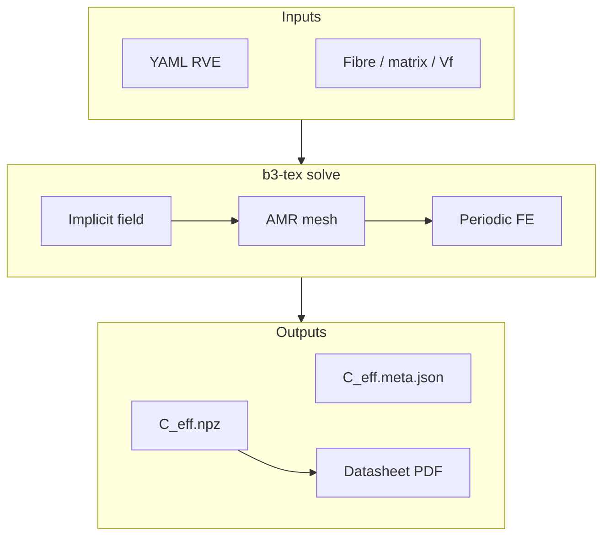

**b3_tex** homogenizes textile-composite **RVEs** (representative volume elements)
using *implicit* yarn geometry — no body-fitted meshing — and returns an effective
Voigt stiffness `C_eff` suitable as an FEA material input.

Yarns are centerline + cross-section fields sampled on a background hex/tet mesh,
optionally refined with **AMR** at tow/matrix interfaces. Backends: **MFEM**
(periodic + hex AMR, recommended) and **DOLFINx** (periodic MPC / KUBC).

## Start here

| Guide | What |
|-------|------|
| [Getting started](/docs/guides/getting-started) | Install, `b3-tex validate` / `solve` |
| [Twill 2×2 stiffness (agent path)](/docs/guides/agent-twill-stiffness) | Full FEA card from fibre / resin / Vf |
| [Material datasheet](/docs/guides/datasheet) | One-page Typst PDF + provenance |
| [Convergence & cost](/docs/guides/convergence) | Smoke vs standard mesh / AMR |

### Reference

| Page | What |
|------|------|
| [Architecture](/docs/reference/architecture) | Package layout and data flow |
| [CLI](/docs/reference/cli) | `validate`, `reference`, `solve`, `datasheet` |
| [Micromechanics](/docs/reference/micromechanics) | Chamis, Mori–Tanaka, surrogates |
| [YAML schema](/docs/reference/yaml-schema) | Field types, materials, solver |

### Agent skill

Repo-root `SKILL.md` is the compact agent playbook (vocabulary, architecture table,
pitfalls). Prefer the guides above for the full narrative; keep `SKILL.md` short.

### Dev KB

With `kb/` present, open **[Dev KB](/dev)** for privileged notes: agent-path gap
analysis, architecture diagrams, and runbooks. Public docs stay under `docs/`.

## What you get

- **`C_eff.npz`** — key `effective_stiffness` (6×6 Voigt, Pa, engineering shear)
- **`C_eff.meta.json`** — backend, mesh, micromodel, yarn Vf, git sha, wall time
- Engineering constants printed on the CLI (`E_x`, `E_y`, `E_z`, `G_ij`, `ν_ij`)
- Optional **datasheet** PDF (RVE + micro + AMR figure + `C_eff` table)
