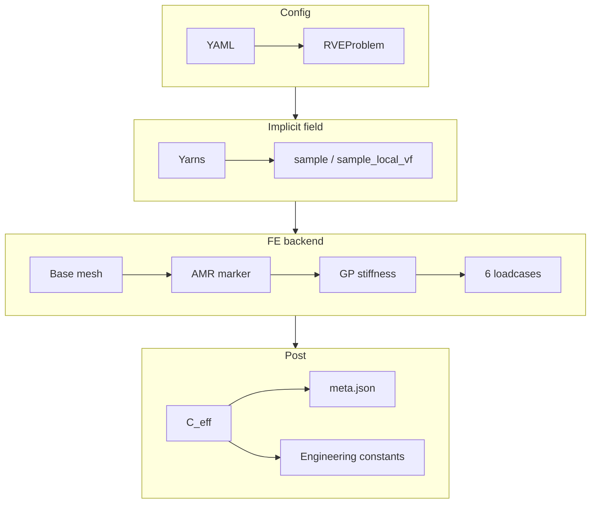

## Repository layout

```
b3_tex/
├── src/b3_tex/
│   ├── backends/          # sole FE imports (dolfinx*, mfem)
│   ├── geometry/          # centerlines, sections, weave patterns
│   ├── generators/        # woven, ncf, braid, 3d woven
│   ├── viz/               # slices, scenes, explainer
│   ├── materials.py
│   ├── micromodels.py     # pluggable MicroModel registry
│   ├── quadrature.py      # GP stiffness + Vf LUT
│   ├── problem.py         # RVEProblem from YAML
│   ├── result.py          # HomogenizationResult + meta sidecar
│   ├── datasheet.py
│   └── cli.py
├── examples/              # YAML RVEs + campaign scripts
├── tests/
├── docs/                  # this Fumadocs site
├── kb/                    # Dev KB + comments (rich mode)
└── SKILL.md               # agent playbook
```

## Homogenization flow



## Design rules

- **No dolfinx outside `backends/`** — core stays NumPy + YAML + scipy.
- **Voigt** `(11, 22, 33, 23, 13, 12)`, engineering shear, `σ = C ε`.
- Yarn local 1-axis = fibre direction (`R[:, 0]`).
- Local Vf: fibre area conserved under compaction → Vf-binned micromodel LUT at GPs.
- Differentiable seam (future autodiff): per-GP `(N_gp, 6, 6)` stiffness array.

## Backends

| Backend | Strength |
|---------|----------|
| `mfem-periodic` | Default; hex NCMesh AMR; efficient weaves |
| `dolfinx-periodic` | Strong on pure tets without AMR |
| `*-kubc` | Upper-bound / sanity check |

Periodic recovers homogeneous matrix stiffness to machine precision (tested).
