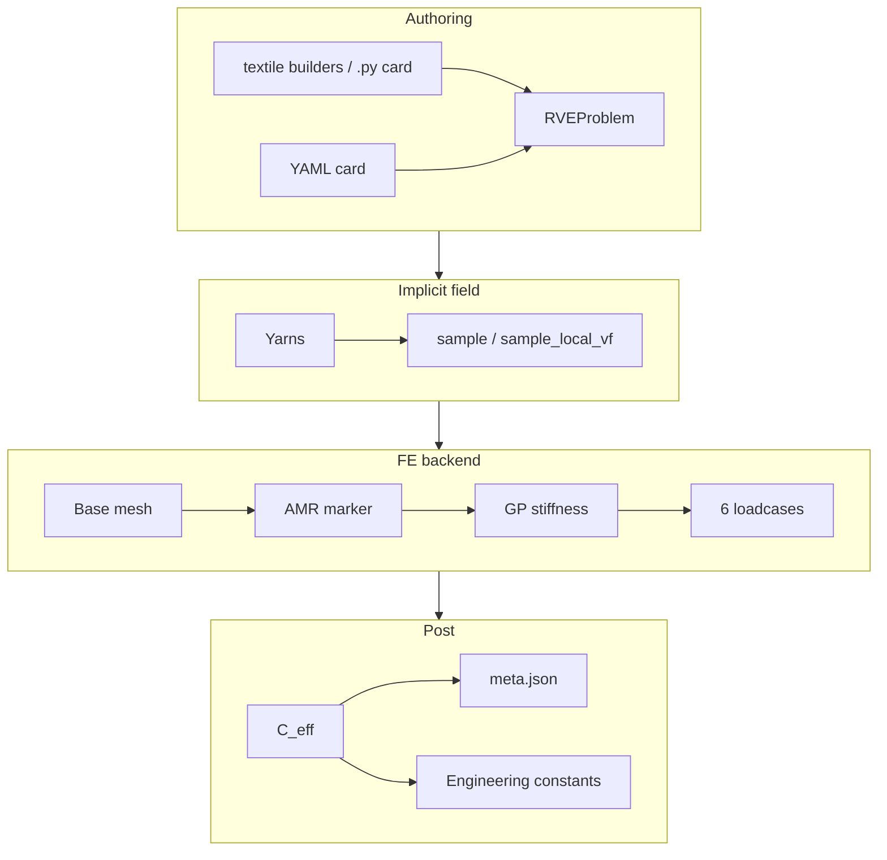

## Repository layout

```
b3_tex/
├── src/b3_tex/
│   ├── backends/          # sole FE imports (dolfinx*, mfem)
│   ├── geometry/          # centerlines, sections, weave patterns
│   ├── generators/        # woven, ncf, braid, 3d woven
│   ├── textile.py         # textile-as-code builders (preferred API)
│   ├── fabric_registry.py # YAML field.type → generator
│   ├── viz/               # slices, scenes, explainer
│   ├── materials.py
│   ├── micromodels.py     # pluggable MicroModel registry
│   ├── quadrature.py      # GP stiffness + Vf LUT
│   ├── problem.py         # RVEProblem (+ from_yaml / from_config)
│   ├── result.py          # HomogenizationResult + meta sidecar
│   ├── datasheet.py
│   └── cli.py
├── examples/              # .py / YAML RVE cards + campaign scripts
├── tests/
├── docs/                  # this Fumadocs site
└── SKILL.md               # agent playbook
```

## Homogenization flow


```mermaid
flowchart TB
  subgraph cfg [Authoring]
    direction LR
    py[textile builders / .py card] --> problem[RVEProblem]
    yaml[YAML card] --> problem
  end
  subgraph field [Implicit field]
    direction LR
    yarns[Yarns] --> sample[sample / sample_local_vf]
  end
  subgraph fe [FE backend]
    direction LR
    mesh[Base mesh] --> amr[AMR marker]
    amr --> assemble[GP stiffness]
    assemble --> solve[6 loadcases]
  end
  subgraph post [Post]
    direction LR
    ceff[C_eff] --> meta[meta.json]
    ceff --> eng[Engineering constants]
  end
  cfg --> field
  field --> fe --> post
```

**Primary authoring:** [textile-as-code](/docs/reference/textile-as-code)
(`b3_tex.textile`). **Optional card format:** [YAML schema](/docs/reference/yaml-schema).
Both end at the same `RVEProblem` → backend path.

## Design rules

- **No dolfinx outside `backends/`** — core stays NumPy + scipy (+ PyYAML for cards).
- **Voigt** `(11, 22, 33, 23, 13, 12)`, engineering shear, `σ = C ε`.
- Yarn local 1-axis = fibre direction (`R[:, 0]`).
- Local Vf: fibre area conserved under compaction → Vf-binned micromodel LUT at GPs.
- Differentiable seam (future autodiff): per-GP `(N_gp, 6, 6)` stiffness array.
- New fabrics: typed builder first; YAML schema only if a serialised card is needed.

## Backends

| Backend | Strength |
|---------|----------|
| `mfem-periodic` | Default; hex NCMesh AMR; efficient weaves |
| `dolfinx-periodic` | Strong on pure tets without AMR |
| `*-kubc` | Upper-bound / sanity check |

Periodic recovers homogeneous matrix stiffness to machine precision (tested).
